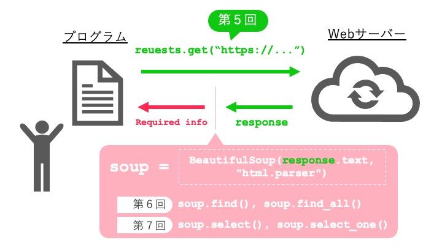

# 第8回：総合演習① - 実際のサイトからデータ収集

## 今回のゴール

- requests と BeautifulSoup を組み合わせて使える
- 実際のWebサイトからデータを取得できる
- 取得したデータを整形してまとめられる
- 複数ページからデータを収集できる

## 所要時間：90分

---

## 8.1 導入：これまでの知識を組み合わせる

これまで、以下の技術を個別に学んできました。

- 第5回：`requests` でWebページを取得する → `requests.get()`
- 第6回：`BeautifulSoup` でHTMLを解析する → `find()`, `find_all()`
- 第7回：CSSセレクタで複雑な要素を取得する → `select()`, `select_one()`

今回の演習では、この3つを組み合わせてデータ収集の**全フロー**を体験します。



この回では、これらの技術を組み合わせて、実際のWebサイトからデータを収集します。

今回使用するのは、スクレイピング学習用に公開されている書籍サイト **Books to Scrape** (https://books.toscrape.com) です。このサイトは練習用に作られているため、安心してスクレイピングできます。

---

## 8.2 ハンズオン：実際のサイトからデータを取得してみよう

以下のコードをファイルに保存して実行してください。

```python
import requests
from bs4 import BeautifulSoup

# 書籍サイトのURL
url = "https://books.toscrape.com"

# ページを取得
response = requests.get(url, timeout=10)
print(f"ステータスコード: {response.status_code}")

# HTMLを解析
soup = BeautifulSoup(response.text, "html.parser")

# 書籍カードを取得（最初の3冊だけ）
books = soup.select("article.product_pod")[:3]

print(f"\n書籍数: {len(books)}冊\n")

for book in books:
    # タイトルを取得
    title = book.select_one("h3 a")["title"]

    # 価格を取得
    price = book.select_one(".price_color").text

    print(f"タイトル: {title}")
    print(f"価格: {price}")
    print("-" * 50)
```

実行すると、書籍のタイトルと価格が表示されます。これが実際のスクレイピングの基本的な流れです。

---

## 解説

### スクレイピングの基本的な流れ

```
1. requests でページを取得
   ↓
2. BeautifulSoup でHTMLを解析
   ↓
3. select() や find() で必要な要素を取得
   ↓
4. .text や ["属性"] でデータを抽出
   ↓
5. 辞書やリストにまとめる
```

### Books to Scrape のHTML構造

このサイトでは、各書籍が以下のような構造になっています。

```html
<article class="product_pod">
  <div class="image_container">
    <a href="catalogue/a-light-in-the-attic_1000/index.html">
      
    </a>
  </div>
  <p class="star-rating Three">
    <i class="icon-star"></i>
  </p>
  <h3>
    <a href="catalogue/a-light-in-the-attic_1000/index.html" title="A Light in the Attic">A Light in ...</a>
  </h3>
  <div class="product_price">
    <p class="price_color">£51.77</p>
    <p class="instock availability">
      <i class="icon-ok"></i>
      In stock
    </p>
  </div>
</article>
```

### データの取得方法

#### タイトルの取得

タイトルは `h3 > a` タグの `title` 属性に格納されています。

```python
title = book.select_one("h3 a")["title"]
```

#### 価格の取得

価格は `class="price_color"` の要素のテキストです。

```python
price = book.select_one(".price_color").text  # "£51.77"
```

#### 評価の取得

評価は `class="star-rating"` の2番目のクラス名で表されています。

```html
<p class="star-rating Three">
```

`Three` が評価（5段階中3）を表しています。

```python
rating_element = book.select_one(".star-rating")
rating = rating_element["class"][1]  # "Three"
```

`class` 属性は複数のクラスを持つことがあり、リストとして取得されます。`["star-rating", "Three"]` のうち、`[1]` で2番目の要素を取得します。

### データの整形

取得したデータは、そのままでは使いにくいことがあります。

```python
# 価格から通貨記号を削除して数値に変換
price_text = "£51.77"
price_value = float(price_text.replace("£", ""))  # 51.77

# 評価を数値に変換
rating_map = {
    "One": 1,
    "Two": 2,
    "Three": 3,
    "Four": 4,
    "Five": 5
}
rating_number = rating_map.get(rating, 0)  # 3
```

---

## 練習問題

### 8.3 問題1：基本的なデータ取得

Books to Scrape のトップページから、最初の5冊の書籍について、以下の情報を辞書のリストにまとめてください。

- タイトル
- 価格（テキストのまま）
- 評価（"Three" など）

```python
import requests
from bs4 import BeautifulSoup

url = "https://books.toscrape.com"
response = requests.get(url, timeout=10)
soup = BeautifulSoup(response.text, "html.parser")

# ここからコードを書く
# 最終的に books = [{"title": "A Light in the Attic", "price": "£51.77", "rating": "Three"}, ...]
```

**考え方のヒント:**

```
手順:
1. article.product_pod を全部取得 → soup.select("article.product_pod")
2. 最初の5冊だけに限定 → [:5]
3. 空のリストを用意 → books = []
4. for で1冊ずつ処理:
   - h3 a の title 属性でタイトル取得
   - .price_color でテキスト取得
   - .star-rating の class 属性の2番目で評価取得
   - 辞書にまとめる
   - リストに追加
5. 結果を表示
```

---

### 8.4 問題2：データの整形

問題1で取得したデータを、以下のように整形してください。

- 価格：`"£51.77"` → `51.77`（数値）
- 評価：`"Three"` → `3`（数値）

```python
# 問題1のコードに続けて、データを整形する

rating_map = {
    "One": 1,
    "Two": 2,
    "Three": 3,
    "Four": 4,
    "Five": 5
}

# 整形されたデータを作成
```

**考え方のヒント:**

- 価格：`"£51.77"` の `£` を `replace()` で削除し、`float()` で数値に変換する
- 評価：`rating_map` の辞書を使って文字列から数値に変換する（`get()` を使うとキーがなくても安全）
- 辞書を作るときに整形した値を使う

---

### 8.5 問題3：条件でフィルタリング

Books to Scrape から、評価が4以上の書籍のみを取得してください。

```python
# 問題2のコードを使って、評価が4以上の本だけを抽出
```

**考え方のヒント:**

- 方法1：for ループで1冊ずつ確認し、評価が4以上のものだけをリストに追加する
- 方法2：リスト内包表記を使って `if` で条件を絞り込む

---

### 8.6 問題4：複数ページからデータ収集

Books to Scrape は複数ページに分かれています。最初の3ページから書籍情報を取得してください。

```python
import requests
from bs4 import BeautifulSoup
import time

base_url = "https://books.toscrape.com/catalogue/page-{}.html"

all_books = []

for page in range(1, 4):  # ページ1〜3
    url = base_url.format(page)
    # ここからコードを書く
    # 各ページから書籍情報を取得してall_booksに追加

    # サーバーに負荷をかけないように少し待つ
    time.sleep(1)

print(f"取得した書籍数: {len(all_books)}冊")
```

**考え方のヒント:**

```
手順:
1. ページ番号を1〜3でループ
2. 各ページのURLを作成
   → https://books.toscrape.com/catalogue/page-1.html
   → https://books.toscrape.com/catalogue/page-2.html
   → https://books.toscrape.com/catalogue/page-3.html
3. requests.get() でページを取得
4. BeautifulSoup で解析
5. 書籍カードを取得してデータを抽出
6. all_books に追加
7. time.sleep(1) で1秒待つ（マナー）

注意: 各ページで同じ処理を繰り返すので、
関数にまとめると読みやすくなる
```

---

### 8.7 問題5：データをCSVファイルに保存（チャレンジ問題）

> **この問題はオプションです。** CSVの保存方法は第10・11回で詳しく学びます。興味があればぜひ挑戦してみてください！

#### CSVファイルへの保存について

CSVとは、データをカンマ区切りで保存するファイル形式です。Excelでも開けるため、収集したデータを保存するのによく使われます。

Pythonでは `csv` モジュールを使います。以下のコードは、辞書のリスト（`data`）を `file.csv` というファイルに保存します。`fieldnames` には辞書のキー（表の列名）を指定します。

```python
import csv

with open("file.csv", "w", encoding="utf-8", newline="") as f:
    writer = csv.DictWriter(f, fieldnames=["col1", "col2"])
    writer.writeheader()   # 1行目にヘッダーを書く
    writer.writerows(data) # データを一括で書く
```

#### 問題

取得した書籍情報をCSVファイルに保存してください。

```python
import csv

# 問題1〜4で取得したデータを使う
books = [
    {"title": "A Light in the Attic", "price": 51.77, "rating": 3},
    {"title": "Tipping the Velvet", "price": 53.74, "rating": 1},
    {"title": "Soumission", "price": 22.65, "rating": 1},
]

# CSVファイルに保存
with open("books.csv", "w", encoding="utf-8", newline="") as f:
    # ここを書く
    pass

print("books.csv に保存しました")
```

**考え方のヒント:**

1. `csv.DictWriter` を使う
2. `fieldnames` に `["title", "price", "rating"]` を指定する
3. `writeheader()` でヘッダー行を書く
4. `writerows(books)` でデータをまとめて書く

---

## 検索キーワード

| 知りたいこと | 検索キーワード |
|-------------|---------------|
| スクレイピングの実践 | `Python スクレイピング 実践例` |
| 複数ページの取得 | `Python スクレイピング ページネーション` |
| CSVファイルへの保存 | `Python csv DictWriter 使い方` |
| time.sleep の使い方 | `Python time.sleep スクレイピング` |
| データの整形 | `Python 文字列 数値 変換` |

---

## 困ったときは

### 「ステータスコード 403 が返ってくる」

サイトがアクセスをブロックしている可能性があります。User-Agent ヘッダーを設定してみてください。

```python
headers = {
    "User-Agent": "Mozilla/5.0 (Windows NT 10.0; Win64; x64) AppleWebKit/537.36"
}
response = requests.get(url, headers=headers)
```

ただし、Books to Scrape は練習用サイトなので、通常はこの問題は起きません。

### 「要素が見つからない」

HTMLの構造を確認してください。

```python
# HTMLを表示
print(soup.prettify())

# 取得した要素を確認
books = soup.select("article.product_pod")
print(f"取得した要素の数: {len(books)}")

# 最初の1件を詳しく見る
if books:
    print(books[0].prettify())
```

### 「AttributeError: 'NoneType' object has no attribute」

要素が見つからずに `None` が返されています。

```python
# 間違い
title = book.select_one("h3 a")["title"]  # None だとエラー

# 正しい（エラーチェック付き）
title_element = book.select_one("h3 a")
if title_element:
    title = title_element["title"]
else:
    title = "タイトルなし"
```

### 「CSV保存で日本語が文字化けする」

`encoding="utf-8"` を指定してください。

```python
with open("books.csv", "w", encoding="utf-8", newline="") as f:
    # writer.writerow(headers) でヘッダー行を書き込む
    # writer.writerow(row) で各行を書き込む
```

Windows の Excel で開くと文字化けする場合は、`encoding="utf-8-sig"` を使うと BOM 付き UTF-8 になり、Excel でも正しく表示されます。

---

## 確認事項

- requests でWebページを取得できた
- BeautifulSoup でHTMLを解析できた
- CSSセレクタで必要な要素を取得できた
- 取得したデータを辞書のリストにまとめられた
- データを整形できた（文字列から数値への変換など）
- 複数ページからデータを取得できた
- サーバーに負荷をかけないよう time.sleep() を使えた
- （チャレンジ）CSVファイルに保存できた

---

## スクレイピングのマナー

実際のサイトをスクレイピングする際は、以下の点に注意してください。

### 必ず守ること

1. **robots.txt を確認する**
   - サイトのルールを守る
   - 禁止されているページにはアクセスしない

2. **アクセス間隔を空ける**
   - 連続アクセスを避ける
   - `time.sleep(1)` などで1〜3秒待つ

3. **User-Agent を設定する**
   - どのプログラムからのアクセスか明示する
   - 連絡先を含めることもある

4. **エラー処理を行う**
   - ネットワークエラーに備える
   - try-except で適切に処理する

### やってはいけないこと

1. **短時間に大量のアクセス**
   - サーバーに負荷をかける
   - 業務妨害になる可能性

2. **利用規約違反**
   - 規約でスクレイピングが禁止されている場合
   - 法的措置を取られる可能性

3. **ログインが必要なページへの不正アクセス**
   - 不正アクセス禁止法違反

---

**次回は「第9回：データ整形とクリーニング」です。取得したデータをより詳しく加工・整形する方法を学びます。**
