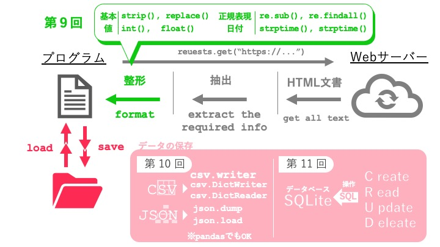

# 第12回：総合演習② - 完全なスクレイピングパイプライン

## 今回のゴール

- これまでの知識を統合して完全なスクレイピングシステムを構築できる
- 複数ページから効率的にデータを収集できる
- データをCSVとSQLiteの両方に保存できる
- エラー処理とリトライを実装できる
- 進捗状況を可視化できる

## 所要時間：120分

---

## 導入：実践的なスクレイピングシステムを作る

これまで学んできた技術を振り返ってみましょう。各回で学んだエラー処理やテクニックは、この総合演習の各段階で活躍します。

- 第5回：HTTP通信でWebページを取得 → **try-except でエラー処理**
- 第6回：BeautifulSoupでHTML解析 → **要素の抽出と属性アクセス**
- 第7回：CSSセレクタで効率的に要素を取得 → **効率的な要素検索**
- 第9回：データの整形とクリーニング → **型変換（str → float）と正規表現**
- 第10回：CSV/JSON保存 → **ファイル操作と write**
- 第11回：データベースSQLite → **データベース操作と with 文**

今回はこれらをすべてつないで、**取得 → 解析 → 整形 → 保存**の完全なパイプラインを作ります。



これらの技術を個別に学んできましたが、実際のプロジェクトでは、これらすべてを組み合わせて使う必要があります。

この回では、Books to Scrape から複数ページにわたって書籍データを収集し、整形して、CSVとデータベースの両方に保存する**完全なスクレイピングパイプライン**を構築します。

---

## ハンズオン：基本的なパイプラインを動かしてみよう

まず、シンプルなパイプラインを作って動かしてみましょう。以下のコードをファイルに保存して実行してください。

```python
import requests
from bs4 import BeautifulSoup
import csv
import re

def fetch_page(url):
    """ページを取得する"""
    try:
        response = requests.get(url, timeout=10)
        response.raise_for_status()
        return response.text
    except requests.exceptions.RequestException as e:
        print(f"エラー: {e}")
        return None

def parse_books(html):
    """HTMLから書籍情報を抽出する"""
    soup = BeautifulSoup(html, "html.parser")
    books = []

    for book in soup.select("article.product_pod"):
        # タイトルを取得
        title = book.select_one("h3 a")["title"]

        # 価格を取得して数値に変換
        price_text = book.select_one(".price_color").text
        # 正規表現で数字とドットだけを抽出（制御文字や通貨記号を除去）
        price_match = re.search(r'\d+\.?\d*', price_text)
        price = float(price_match.group()) if price_match else 0.0

        # 評価を取得
        rating_element = book.select_one(".star-rating")
        rating = rating_element["class"][1]

        books.append({
            "title": title,
            "price": price,
            "rating": rating
        })

    return books

def save_to_csv(books, filename):
    """書籍データをCSVに保存する"""
    with open(filename, "w", encoding="utf-8", newline="") as f:
        writer = csv.DictWriter(f, fieldnames=["title", "price", "rating"])
        writer.writeheader()
        writer.writerows(books)
    print(f"{filename} に保存しました")

# メイン処理
def main():
    url = "https://books.toscrape.com"

    print("データ取得中...")
    html = fetch_page(url)

    if html:
        print("データ解析中...")
        books = parse_books(html)
        print(f"{len(books)}冊の書籍を取得しました")

        print("CSVに保存中...")
        save_to_csv(books, "books.csv")
        print("完了！")
    else:
        print("データ取得に失敗しました")

if __name__ == "__main__":
    main()
```

実行すると、Books to Scrape のトップページから書籍情報を取得して、CSVファイルに保存します。このコードは、処理を機能ごとに分割しており、読みやすく保守しやすい構造になっています。

### `if __name__ == "__main__":` について

Python には `__name__` という特別な変数があり、**スクリプトの実行方法によって自動的に値が変わります**：

- **直接実行した場合** → `__name__` が `"__main__"` に設定される
- **モジュールとしてインポートした場合** → `__name__` がモジュール名に設定される

実際に試してみるとわかります：

```python
# hands_on.py の先頭に追加して実行してみる
print(f"__name__ の値: {__name__}")

if __name__ == "__main__":
    main()
```

**実行結果の違い：**

```bash
# 直接実行した場合
$ python hands_on.py
__name__ の値: __main__
# → if 文の条件が真になるので、main() が実行される

# 別ファイルからインポートした場合
$ python -c "from hands_on import fetch_page"
__name__ の値: hands_on
# → if 文の条件が偽になるので、main() は実行されない
```

**なぜ必要か：**
このif文があることで、ファイルを直接実行するときは処理が走り、他のファイルから関数をインポートするときは処理が走らないようにできます。これにより、関数を再利用する際の意図しない実行を防げます。

---

## 解説

### パイプラインとは

**パイプライン**とは、データが複数の処理段階を順番に通過していく仕組みのことです。

```
データソース → 取得 → 解析 → 整形 → 保存
    ↓          ↓      ↓      ↓      ↓
  Webサイト  requests  BS4  クリーン CSV/DB
```

### パイプラインの設計原則

#### 1. 責任の分離

各関数は1つのことだけを行うようにします。

```python
# 良い例：責任が分離されている
def fetch_page(url):
    """ページの取得だけを行う"""
    pass

def parse_books(html):
    """HTMLの解析だけを行う"""
    pass

def save_to_csv(books, filename):
    """CSVへの保存だけを行う"""
    pass

# 悪い例：1つの関数で全部やる
def scrape_and_save(url, filename):
    """取得、解析、保存を全部やる（分かりにくい）"""
    pass
```

#### 2. エラー処理

各段階でエラーが起きる可能性があります。適切にエラーを処理します。

```python
def fetch_page(url):
    try:
        response = requests.get(url, timeout=10)
        response.raise_for_status()  # ステータスコードをチェック
        return response.text
    except requests.exceptions.RequestException as e:
        print(f"エラー: {e}")
        return None  # エラー時はNoneを返す
```

#### 3. 進捗の可視化

長時間かかる処理では、都度プログラムの実行進捗を表示することで、以下のメリットが得られます：

- **完了予測**: プログラムがいつ終わるか把握できる
- **エラー箇所の特定**: 処理が止まった場合、どこで失敗したか分かりやすい
- **信頼感**: 進捗が見えることで「プログラムが正常に動いている」と確認できる

```python
print(f"ページ {page_num} を取得中...")
print(f"{len(books)}冊の書籍を取得しました")
```

### 複数ページの取得（ページネーション）

Books to Scrape は複数ページに分かれています。全ページからデータを取得するには、ページ番号を変えながら繰り返しアクセスします。

```python
def scrape_all_pages(max_pages=5):
    """複数ページから書籍を取得"""
    all_books = []

    for page_num in range(1, max_pages + 1):
        url = f"https://books.toscrape.com/catalogue/page-{page_num}.html"
        print(f"ページ {page_num} を取得中...")

        html = fetch_page(url)
        if html:
            books = parse_books(html)
            all_books.extend(books)
            print(f"  → {len(books)}冊取得")

        # サーバーに負荷をかけないよう待機
        time.sleep(1)

    return all_books
```

### SQLiteデータベースへの保存

CSVは手軽ですが、大量のデータや複雑な検索には向いていません。SQLiteを使うと、データベースとして管理できます。

```python
import sqlite3

def save_to_database(books, db_name="books.db"):
    """書籍データをSQLiteに保存"""
    conn = sqlite3.connect(db_name)
    cursor = conn.cursor()

    # テーブルを作成
    cursor.execute("""
        CREATE TABLE IF NOT EXISTS books (
            id INTEGER PRIMARY KEY AUTOINCREMENT,
            title TEXT NOT NULL,
            price REAL,
            rating TEXT
        )
    """)

    # データを挿入
    for book in books:
        cursor.execute("""
            INSERT INTO books (title, price, rating)
            VALUES (?, ?, ?)
        """, (book["title"], book["price"], book["rating"]))

    conn.commit()
    conn.close()
    print(f"{db_name} に{len(books)}冊を保存しました")
```

### リトライ処理

ネットワークエラーが起きた場合、自動的に再試行する機能を追加できます。

```python
import time

def fetch_page_with_retry(url, max_retries=3):
    """リトライ機能付きでページを取得"""
    for attempt in range(1, max_retries + 1):
        try:
            response = requests.get(url, timeout=10)
            response.raise_for_status()
            return response.text
        except requests.exceptions.RequestException as e:
            print(f"エラー（試行{attempt}/{max_retries}）: {e}")
            if attempt < max_retries:
                wait_time = 2 ** attempt  # 指数バックオフ
                print(f"{wait_time}秒待機してリトライ...")
                time.sleep(wait_time)
            else:
                print("最大リトライ回数に達しました")
                return None
```

---

## 練習問題

### 問題1：複数ページからデータ取得

Books to Scrape の最初の5ページから書籍情報を取得して、CSVに保存してください。

```python
import requests
from bs4 import BeautifulSoup
import csv
import time

def fetch_page(url):
    # ここを実装
    pass

def parse_books(html):
    # ここを実装
    pass

def scrape_multiple_pages(num_pages):
    # ここを実装
    pass

def save_to_csv(books, filename):
    # ここを実装
    pass

# メイン処理
all_books = scrape_multiple_pages(5)
save_to_csv(all_books, "books_all.csv")
print(f"合計 {len(all_books)} 冊を取得しました")
```

**考え方のヒント:**

```
手順:
1. fetch_page(): ハンズオンのコードを参考に実装
2. parse_books(): ハンズオンのコードを参考に実装
3. scrape_multiple_pages():
   - range(1, num_pages + 1) でページ番号をループ
   - URLを構築: f"https://books.toscrape.com/catalogue/page-{page}.html"
   - fetch_page() でHTML取得
   - parse_books() で書籍データ抽出
   - all_books.extend(books) で追加
   - time.sleep(1) で1秒待機
4. save_to_csv(): ハンズオンのコードを参考に実装
```

---

### 問題2：データベースへの保存

問題1で取得したデータをSQLiteデータベースに保存してください。

```python
import sqlite3

def create_database(db_name):
    """データベースとテーブルを作成"""
    # ここを実装
    pass

def save_to_database(books, db_name):
    """書籍データをデータベースに保存"""
    # ここを実装
    pass

def query_database(db_name):
    """データベースから高額な書籍を検索"""
    # ここを実装
    # 価格が50以上の書籍を取得して表示
    pass

# 実行
all_books = scrape_multiple_pages(5)
create_database("books.db")
save_to_database(all_books, "books.db")
query_database("books.db")
```

**考え方のヒント:**

```
create_database():
1. sqlite3.connect() でデータベースに接続
2. cursor.execute() でCREATE TABLE文を実行
   CREATE TABLE IF NOT EXISTS books (
       id INTEGER PRIMARY KEY AUTOINCREMENT,
       title TEXT NOT NULL,
       price REAL,
       rating TEXT
   )
3. commit() してclose()

save_to_database():
1. sqlite3.connect() で接続
2. for でbooksをループ
3. INSERT文を実行
   INSERT INTO books (title, price, rating) VALUES (?, ?, ?)
4. commit() してclose()

query_database():
1. sqlite3.connect() で接続
2. SELECT文を実行
   SELECT * FROM books WHERE price >= 50
3. fetchall() で結果を取得
4. 結果を表示
```

---

### 問題3：評価別の集計

データベースから評価（rating）別に書籍数を集計して表示してください。

```python
def aggregate_by_rating(db_name):
    """評価別に書籍数を集計"""
    # ここを実装
    # 評価ごとの書籍数を表示
    pass

# 実行
aggregate_by_rating("books.db")
# 期待される出力:
# Five: 25冊
# Four: 30冊
# Three: 20冊
# Two: 15冊
# One: 10冊
```

**考え方のヒント:**

```
手順:
1. sqlite3.connect() で接続
2. GROUP BY を使った集計クエリ
   SELECT rating, COUNT(*) as count
   FROM books
   GROUP BY rating
   ORDER BY count DESC
3. fetchall() で結果を取得
4. for でループして表示

または、Pythonで集計:
1. SELECT * FROM books ですべて取得
2. Pythonの辞書で集計
   rating_counts = {}
   for book in books:
       rating = book[3]  # ratingのカラム
       rating_counts[rating] = rating_counts.get(rating, 0) + 1
```

---

### 問題4：進捗バーの実装

`tqdm` ライブラリを使って、データ取得の進捗をバーで表示してください。

```python
from tqdm import tqdm
import time

def scrape_with_progress(num_pages):
    """進捗バー付きでスクレイピング"""
    all_books = []

    # tqdm を使ってプログレスバーを表示しながらページを取得
    # ここを実装
    pass

    return all_books

# 実行
all_books = scrape_with_progress(10)
print(f"\n合計 {len(all_books)} 冊を取得しました")
```

**実行すると以下のような進捗バーが表示されます:**

```
ページ取得中: 40%|████      | 4/10 [00:08<00:12,  2.10s/it]
```

**考え方のヒント:**

```
tqdm のインストール:
pip install tqdm

基本的な使い方:
from tqdm import tqdm

for i in tqdm(range(100)):
    # 処理
    pass

パラメータ:
- desc: 進捗バーの説明
- total: 総数（自動で計算されることもある）
- unit: 単位（デフォルトは "it"）

例:
for page in tqdm(range(1, 11), desc="取得中", unit="ページ"):
    # 処理
```

---

### 問題5：完全なパイプラインの構築

以下の機能を持つ完全なスクレイピングシステムを作成してください。

**要件:**
1. 複数ページから書籍情報を取得（ページ数は引数で指定可能）
2. 価格を数値に、評価を数値に変換
3. CSVとSQLiteの両方に保存
4. エラー時のリトライ機能
5. 進捗表示
6. 実行時間の計測

```python
import requests
from bs4 import BeautifulSoup
import csv
import sqlite3
import time
from tqdm import tqdm

class BookScraper:
    """書籍スクレイピングシステム"""

    def __init__(self, base_url="https://books.toscrape.com"):
        self.base_url = base_url
        self.rating_map = {
            "One": 1, "Two": 2, "Three": 3, "Four": 4, "Five": 5
        }

    def fetch_page(self, url, max_retries=3):
        """リトライ機能付きでページを取得"""
        # ここを実装
        pass

    def parse_books(self, html):
        """HTMLから書籍情報を抽出して整形"""
        # ここを実装
        # 価格と評価を数値に変換
        pass

    def scrape(self, num_pages):
        """複数ページから書籍を取得"""
        # ここを実装
        # tqdm で進捗表示
        pass

    def save_to_csv(self, books, filename):
        """CSVに保存"""
        # ここを実装
        pass

    def save_to_database(self, books, db_name):
        """SQLiteに保存"""
        # ここを実装
        pass

    def run(self, num_pages=5):
        """パイプライン全体を実行"""
        start_time = time.time()

        print("=" * 50)
        print("書籍スクレイピングシステム")
        print("=" * 50)

        # データ取得
        books = self.scrape(num_pages)

        # 保存
        self.save_to_csv(books, "books_complete.csv")
        self.save_to_database(books, "books_complete.db")

        # 結果表示
        elapsed_time = time.time() - start_time
        print("\n" + "=" * 50)
        print(f"✅ 完了!")
        print(f"取得冊数: {len(books)}冊")
        print(f"実行時間: {elapsed_time:.2f}秒")
        print("=" * 50)

# 実行
if __name__ == "__main__":
    scraper = BookScraper()
    scraper.run(num_pages=10)
```

**考え方のヒント:**

```
クラス設計のポイント:
1. __init__(): 初期設定
   - base_url を保存
   - rating_map を定義

2. fetch_page(): 問題1の実装 + リトライ機能
   - try-except でエラー処理
   - for でリトライループ
   - 指数バックオフ

3. parse_books(): 問題1の実装 + データ整形
   - soup.select() で書籍要素を取得
   - 価格: float(price.replace("£", ""))
   - 評価: self.rating_map[rating_text]

4. scrape(): 問題1の実装 + tqdm
   - for page in tqdm(range(...))
   - fetch_page() と parse_books() を呼び出し
   - all_books.extend(books)

5. save_to_csv(): 問題1の実装

6. save_to_database(): 問題2の実装

7. run(): 全体の制御
   - 開始時刻を記録
   - scrape() 実行
   - save_to_csv() と save_to_database() 実行
   - 結果と実行時間を表示
```

---

## 検索キーワード

| 知りたいこと | 検索キーワード |
|-------------|---------------|
| ページネーションの実装 | `Python スクレイピング ページネーション` |
| SQLite の使い方 | `Python SQLite 使い方 入門` |
| リトライ処理の実装 | `Python requests リトライ` |
| 指数バックオフ | `exponential backoff Python` |
| 進捗バーの表示 | `Python tqdm 使い方` |
| クラス設計 | `Python クラス 設計 パターン` |
| データベース集計 | `SQLite GROUP BY 集計` |

---

## 困ったときは

### 「複数ページを取得すると403エラーが出る」

短時間に大量のアクセスをするとブロックされることがあります。`time.sleep()` で待機時間を長くしてください（2〜3秒程度）。

```python
time.sleep(2)  # 2秒待機
```

また、User-Agentヘッダーを設定すると改善することがあります。

```python
headers = {
    "User-Agent": "Mozilla/5.0 (Windows NT 10.0; Win64; x64) AppleWebKit/537.36"
}
response = requests.get(url, headers=headers)
```

### 「SQLiteの操作でエラーが出る」

よくあるエラーと対処法：

```python
# エラー: table books already exists
# 対処: IF NOT EXISTS を使う
cursor.execute("""
    CREATE TABLE IF NOT EXISTS books (...)
""")

# エラー: no such table: books
# 対処: テーブルが作成されているか確認
cursor.execute("SELECT name FROM sqlite_master WHERE type='table'")
print(cursor.fetchall())

# エラー: database is locked
# 対処: commit() と close() を必ず実行
conn.commit()
conn.close()
```

### 「tqdm がインストールできない」

仮想環境が有効になっているか確認してください。

```bash
# 仮想環境を有効化（Mac/Linux）
source .venv/bin/activate

# 仮想環境を有効化（Windows PowerShell）
.\.venv\Scripts\Activate.ps1

# インストール
pip install tqdm
```

### 「進捗バーが複数行表示される」

`print()` を使う場合、`\r` を使ってカーソルを行頭に戻すと、同じ行に表示できます。

```python
# 悪い例: 毎回新しい行に表示される
for i in range(10):
    print(f"進捗: {i}/10")

# 良い例: 同じ行を更新
for i in range(10):
    print(f"\r進捗: {i}/10", end="")
print()  # 最後に改行
```

ただし、`tqdm` を使う場合は自動的に処理されます。

### 「クラス設計が分からない」

クラスは基本情報の教材で触れていますが、ここでは初出に近い内容です。自走学習を前提として、以下の方法で学習を進めることをお勧めします。

**段階的な実装法（おすすめ）:**

```python
# Step 1: 関数で実装して動かす
def fetch_page(url):
    pass

def parse_books(html):
    pass

def scrape_all(num_pages):
    pass

# Step 2: 関数をまとめてクラスにする
class BookScraper:
    def __init__(self, base_url):
        self.base_url = base_url  # self. で保存
    
    def fetch_page(self, url):
        pass

    def parse_books(self, html):
        pass
    
    def scrape_all(self, num_pages):
        pass
```

**分からないキーワードが出たら、以下の手順で調べてください：**

1. **Google で検索する**
   ```
   例えば：「Python self とは」「Python __init__ とは」
   ```

2. **優先順位：**
   - ① 公式ドキュメント（https://docs.python.org/ja/）
   - ② Qiita や note などの解説記事
   - ③ YouTube の Python 入門動画
   - ※ 公式ドキュメントが最も正確です

3. **つまずきやすい概念の説明リンク：**
   - `self` について：「Python self の意味」で検索
   - `__init__` について：「Python コンストラクタ」で検索
   - インスタンス変数：「Python self. で保存する」で検索

4. **調べても分からなかったら：**
   - クラスの基本は「関数の集まりをまとめたもの」くらいの理解で OK
   - Step 1（関数版）で完全に動かしてから、Step 2（クラス版）に進む

---

## 実装のベストプラクティス

**このセクションについて:**

練習問題の基本実装で、動作するスクレイピングパイプラインは完成します。ただし、実務レベルのコードではさらに工夫が必要です。以下は「すぐには必須ではないが、知っておくと役立つ」テクニックです。興味がある項目や、プロジェクトで必要になったときに取り組んでください。

---

### 1. ログの記録

実行状況をファイルに記録すると、後で問題を調査しやすくなります。

```python
import logging

# ログの設定
logging.basicConfig(
    filename="scraping.log",
    level=logging.INFO,
    format="%(asctime)s - %(levelname)s - %(message)s"
)

# 使用例
logging.info("スクレイピング開始")
logging.warning("ページ3の取得に失敗")
logging.error("データベース接続エラー")
```

### 2. 設定の外部化

URLやページ数などの設定を、コードの外に出すと柔軟性が増します。

```python
# config.py
BASE_URL = "https://books.toscrape.com"
NUM_PAGES = 10
SLEEP_TIME = 1
MAX_RETRIES = 3
```

```python
# main.py
import config

scraper = BookScraper(base_url=config.BASE_URL)
scraper.run(num_pages=config.NUM_PAGES)
```

### 3. 重複チェック

同じデータを二重に保存しないよう、データベースにUNIQUE制約を付けます。

```python
cursor.execute("""
    CREATE TABLE IF NOT EXISTS books (
        id INTEGER PRIMARY KEY AUTOINCREMENT,
        title TEXT NOT NULL UNIQUE,  -- UNIQUEを追加
        price REAL,
        rating TEXT
    )
""")

# 重複時は無視する
cursor.execute("""
    INSERT OR IGNORE INTO books (title, price, rating)
    VALUES (?, ?, ?)
""", (title, price, rating))
```

### 4. ユニットテスト

各関数が正しく動作するかテストします。

```python
# test_scraper.py
import unittest
from scraper import BookScraper

class TestBookScraper(unittest.TestCase):
    def test_parse_price(self):
        scraper = BookScraper()
        html = '<p class="price_color">£51.77</p>'
        # テストを実装
        pass

if __name__ == "__main__":
    unittest.main()
```

---

## 確認事項

- [ ] 複数ページから書籍情報を取得できた
- [ ] データを適切に整形できた（価格と評価を数値に変換）
- [ ] CSVファイルに保存できた
- [ ] SQLiteデータベースに保存できた
- [ ] データベースからデータを検索できた
- [ ] エラー処理とリトライを実装できた
- [ ] 進捗バーを表示できた
- [ ] 実行時間を計測できた
- [ ] クラスを使ってコードを整理できた
- [ ] サーバーに負荷をかけないよう適切な待機時間を設定した

---

## 発展課題

余裕がある人は、以下の機能を追加してみましょう。

### 1. カテゴリー別の取得

Books to Scrape には複数のカテゴリーがあります。特定のカテゴリーの書籍だけを取得してみましょう。

```python
# 例: Travel カテゴリーの書籍を取得
# https://books.toscrape.com/catalogue/category/books/travel_2/index.html
```

### 2. 詳細ページの情報取得

各書籍の詳細ページに遷移して、説明文や在庫数などの追加情報を取得してみましょう。

### 3. 非同期処理

`asyncio` と `aiohttp` を使って、複数のページを並列で取得してみましょう（高度）。

### 4. Webアプリ化

Flask や Streamlit を使って、スクレイピング結果をWebページで表示してみましょう。

---

**おめでとうございます！これで完全なスクレイピングパイプラインを構築できるようになりました。次回は、さらに高度なトピックに進みます。**
