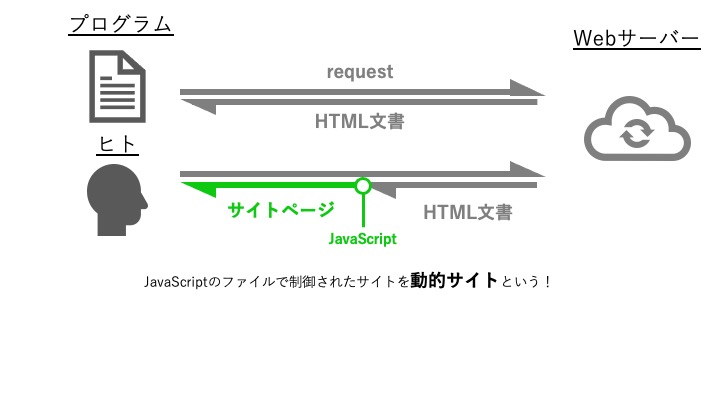

# 第13回：静的サイトと動的サイト - なぜデータが取れないのか

## 今回のゴール

- 静的サイトと動的サイトの違いがわかる
- JavaScriptの役割がわかる
- なぜ `requests` でデータが取れない場合があるかわかる
- 動的サイトの見分け方がわかる
- デベロッパーツールを使える
- 次回学ぶSeleniumの必要性がわかる

## 所要時間：60分

---

## 導入：「データが取れない！」という壁

これまで学んだ方法で、以下のコードを書いたとします。

```python
import requests
from bs4 import BeautifulSoup

url = "https://example.com/products"
response = requests.get(url)
soup = BeautifulSoup(response.text, "html.parser")

products = soup.select(".product")
print(f"商品数: {len(products)}件")  # → 0件！？
```

ブラウザで開くと商品が表示されているのに、プログラムでは取得できない。これは**動的サイト**だからです。

この回では、なぜこのような現象が起きるのかを理解します。

---

## ハンズオン：静的サイトと動的サイトを比較してみよう

以下の2つのサイトで、データが取得できるか試してみましょう。

### サイト1: 静的サイト（データが取得できる）

```python
import requests
from bs4 import BeautifulSoup

# 静的サイト
url = "https://quotes.toscrape.com/"
response = requests.get(url)
soup = BeautifulSoup(response.text, "html.parser")

# 名言を取得
quotes = soup.select(".quote")
print(f"【静的サイト】名言の数: {len(quotes)}件")

if quotes:
    print("最初の名言:")
    print(quotes[0].select_one(".text").text)
```

### サイト2: 動的サイト（データが取得できない）

```python
import requests
from bs4 import BeautifulSoup

# 動的サイト（JavaScriptで生成）
url = "https://quotes.toscrape.com/js/"
response = requests.get(url)
soup = BeautifulSoup(response.text, "html.parser")

# 名言を取得
quotes = soup.select(".quote")
print(f"\n【動的サイト】名言の数: {len(quotes)}件")

# HTMLを確認
print("\n取得したHTML（一部）:")
print(response.text[:500])
```

実行すると、以下のような結果になります。

```
【静的サイト】名言の数: 10件
最初の名言:
"The world as we have created it is a process of our thinking..."

【動的サイト】名言の数: 0件

取得したHTML（一部）:
<!DOCTYPE html>
<html lang="en">
<head>
	<meta charset="UTF-8">
	<title>Quotes to Scrape</title>
    ...
</head>
<body>
    ...
    <script src="/static/jquery.js"></script>
    <script>
        var data = [{"tags": [...], "author": {...}, "text": "..."}, ...]
        // データはJavaScript変数として埋め込まれており、
        // JavaScriptが実行されて初めてHTMLに書き出される
    </script>
```

動的サイトでは、HTML内に `<div id="quotes"></div>` という空の要素しかなく、実際のデータはJavaScriptで後から追加されます。

---

## 解説

### 静的サイトと動的サイトの違い

まず全体像を把握しましょう。



では、ユーザーがサイトを開いた際、**サーバーとブラウザの動きにどのような違いがあるでしょうか？** 以下で確認してみましょう。

#### 静的サイト

**サーバー側**でHTMLを生成し、完成したHTMLをブラウザに送る。

```
1. ブラウザ「このページください」
   ↓
2. サーバー「HTMLを作成中...」
   ↓
3. サーバー「完成したHTMLをどうぞ」
   → <html><body><div class="product">商品A</div>...</body></html>
   ↓
4. ブラウザ「HTMLを表示します」
```

**特徴:**
- HTMLの中に最初からデータが含まれている
- `requests` でHTMLを取得すれば、データも取得できる
- 従来型のWebサイトに多い

#### 動的サイト

**ブラウザ側**（JavaScript）でHTMLを生成する。

```
1. ブラウザ「このページください」
   ↓
2. サーバー「最小限のHTMLをどうぞ」
   → <html><body><div id="root"></div><script src="app.js"></script></body></html>
   ↓
3. ブラウザ「JavaScriptを実行中...」
   ↓
4. JavaScript「APIからデータ取得中...」
   ↓
5. JavaScript「HTMLを生成して表示！」
   → <div id="root"><div class="product">商品A</div>...</div>
```

**特徴:**
- 最初のHTMLは空（またはほぼ空）
- JavaScriptが実行されて初めてデータが表示される
- `requests` で取得したHTMLには、データが含まれていない
- 現代のWebサイト（SPA: Single Page Application）に多い

### なぜrequestsでは取得できないのか

`requests` はHTMLを取得するだけで、JavaScriptを**実行しない**からです。

```python
import requests

response = requests.get("https://quotes.toscrape.com/js/")
html = response.text

# この時点のHTML:
# <div id="quotes"></div>  ← 空
# <script src="quotes.js"></script>  ← 未実行

# JavaScriptは実行されないので、データは生成されない
```

ブラウザは以下を行います:
1. HTMLを取得
2. **JavaScriptを実行**
3. データを表示

`requests` は1だけを行い、2と3を行いません。

### JavaScriptとは

**JavaScript**は、ブラウザ上で動くプログラミング言語です。

```javascript
// JavaScript の例
document.getElementById("quotes").innerHTML = "<div>名言が入る</div>";
```

動的サイトでは、JavaScriptが以下のようなことを行います:

| JavaScriptの役割 | 例 |
|-----------------|-----|
| データの取得 | APIから商品情報を取得 |
| HTMLの生成 | 取得したデータからHTMLを作成 |
| 表示の更新 | 画面に商品を表示 |
| ユーザー操作 | ボタンクリックで次のページを表示 |

### 静的サイトと動的サイトの見分け方

#### 方法A: requestsで取得したHTMLを確認

```python
import requests
from bs4 import BeautifulSoup

response = requests.get(url)
soup = BeautifulSoup(response.text, "html.parser")

# 目的のデータを探す
products = soup.select(".product")

if len(products) == 0:
    print("動的サイトの可能性が高い")
    print("\nHTMLを確認:")
    print(response.text[:1000])
else:
    print("静的サイト（requestsで取得可能）")
```

#### 方法B: ブラウザのデベロッパーツールを使う

**デベロッパーツール**（開発者ツール）を使うと、サイトの仕組みが分かります。

##### デベロッパーツールの開き方

| ブラウザ | 方法 |
|---------|------|
| Chrome | F12キー または 右クリック→「検証」 |
| Firefox | F12キー または 右クリック→「要素を調査」 |
| Safari | Cmd+Option+I（設定で有効化が必要） |

##### 確認手順

1. サイトを開く
2. F12キーを押してデベロッパーツールを開く
3. 「Elements」（または「要素」）タブを選択
4. 目的のデータを右クリック→「検証」

**静的サイトの場合:**
```html
<!-- HTMLの中に最初からデータがある -->
<div class="product">
  <h2>商品名</h2>
  <span class="price">1000円</span>
</div>
```

**動的サイトの場合:**
```html
<!-- 空の要素 -->
<div id="root"></div>
<div id="app"></div>

<!-- または読み込み中の表示 -->
<div class="loading">読み込み中...</div>
```

#### 方法C: ページのソースを表示

##### ページのソースとは

ブラウザが**最初に受け取ったHTML**（JavaScriptが実行される前）を見る機能です。

##### ページのソースの表示方法

| ブラウザ | 方法 |
|---------|------|
| すべて | 右クリック→「ページのソースを表示」 |
| Chrome | Ctrl+U（Windows）、Cmd+Option+U（Mac） |

##### 確認方法

1. ページのソースを表示
2. Ctrl+F（Cmd+F）で検索
3. 目的のデータ（商品名など）を検索

**静的サイト:**
- データが見つかる → HTMLに最初から含まれている

**動的サイト:**
- データが見つからない → JavaScriptで後から追加される
- `<script src="..."></script>` が多数ある

#### 方法D: Networkタブでリクエストを確認

デベロッパーツールの「Network」タブで、サイトがどこからデータを取得しているか確認できます。

##### 確認手順

1. デベロッパーツールを開く
2. 「Network」タブを選択
3. ページをリロード（F5キー）
4. 「XHR」または「Fetch/XHR」をクリック

**動的サイトの特徴:**
- API（例: `/api/products`）へのリクエストが表示される
- JSONデータが返ってくる

このAPIのURLに直接アクセスすれば、データを取得できる場合があります。

### 動的サイトへの対処法

| 方法 | 難易度 | 説明 |
|------|-------|------|
| **Selenium** | ⭐⭐ | ブラウザを自動操作（次回詳しく） |
| **APIを直接叩く** | ⭐⭐⭐ | NetworkタブでAPIを見つける |
| **Playwright/Puppeteer** | ⭐⭐⭐ | Seleniumより高速（上級者向け） |

次回のlesson14では、**Selenium**を使って動的サイトをスクレイピングする方法を学びます。

---

## 練習問題

### 問題1：静的サイトと動的サイトを比較

`python/lesson13/01_static_dynamic_compare.py` に回答を書いてください。

以下の2つのサイトでデータが取得できるか確認してください。

```python
# サイト1: https://quotes.toscrape.com/
# サイト2: https://quotes.toscrape.com/js/

# 1. それぞれrequestsで取得
# 2. .quote の数を表示
# 3. 取得したHTMLの一部を表示
# 4. 静的か動的か判定
```

**考え方のヒント:**

```
手順:
1. requests.get() でHTMLを取得
2. BeautifulSoup で解析
3. .select(".quote") で要素を取得
4. len() で個数を確認
5. len が 0 なら動的サイト
```

---

### 問題2：HTMLの中身を確認

`python/lesson13/02_inspect_html.py` に回答を書いてください。

問題1の動的サイトで取得したHTMLを詳しく見て、なぜデータが取得できないか説明してください。

```python
# https://quotes.toscrape.com/js/ のHTMLを取得
# 1. HTMLを全部表示
# 2. "quote" という文字列を検索
# 3. <script> タグを探す
# 4. 結果から何が分かるか考える
```

**考え方のヒント:**

```
# HTMLを検索
if "class=\"quote\"" in response.text:
    print("HTMLに .quote がある")
else:
    print("HTMLに .quote がない")

# <script> タグを探す
scripts = soup.find_all("script")
print(f"scriptタグの数: {len(scripts)}")
```

---

### 問題3：ブラウザで確認

`python/lesson13/03_browser_check.py` に回答を書いてください。

以下のサイトをブラウザで開き、デベロッパーツールで確認してください。

1. https://quotes.toscrape.com/js/
2. F12キーを押す
3. 「Elements」タブで `<div id="quotes">` を探す
4. 中に何が入っているか確認
5. 「Network」タブでリロード
6. どんなリクエストが発生しているか確認

**考え方のヒント:**

```
確認ポイント:
- Elementsタブ: <div id="quotes"> の中身
  → JavaScriptで生成された要素が入っている

- Networkタブ: XHR/Fetch
  → API へのリクエストを探す
  → レスポンスがJSONかHTMLか確認
```

---

### 問題4：ページのソースを表示

`python/lesson13/04_view_page_source.py` に回答を書いてください。

以下のサイトでページのソースを表示し、違いを確認してください。

1. https://quotes.toscrape.com/（静的）
2. https://quotes.toscrape.com/js/（動的）

それぞれのHTMLソースで「The world as we have created it」を検索してください。

**考え方のヒント:**

```
手順:
1. 右クリック→「ページのソースを表示」
2. Ctrl+F（Cmd+F）で検索ボックスを開く
3. 名言の一部を検索

静的サイト:
→ ソースに名言が見つかる

動的サイト:
→ ソースに名言が見つからない
→ JavaScriptで後から追加される
```

---

### 問題5：自動判定プログラム

`python/lesson13/05_auto_detect.py` に回答を書いてください。

URLを入力すると、静的サイトか動的サイトか自動判定するプログラムを作ってください。

```python
def is_dynamic_site(url, selector):
    """
    サイトが動的かどうか判定する

    Args:
        url: チェックするURL
        selector: 探す要素のCSSセレクタ

    Returns:
        True: 動的サイト
        False: 静的サイト
    """
    # ここを実装
    pass

# テスト
result1 = is_dynamic_site("https://quotes.toscrape.com/", ".quote")
result2 = is_dynamic_site("https://quotes.toscrape.com/js/", ".quote")

print(f"quotes.toscrape.com/: {'動的' if result1 else '静的'}")
print(f"quotes.toscrape.com/js/: {'動的' if result2 else '静的'}")
```

**考え方のヒント:**

```
手順:
1. requests.get() で取得
2. BeautifulSoup で解析
3. soup.select(selector) で要素を探す
4. len(要素) が 0 なら動的サイト
5. True/False を返す
```

---

## 検索キーワード

| 知りたいこと | 検索キーワード |
|-------------|---------------|
| 静的・動的サイトの違い | `静的サイト 動的サイト 違い` |
| JavaScriptとは | `JavaScript とは 初心者` |
| デベロッパーツール | `Chrome デベロッパーツール 使い方` |
| SPAとは | `SPA Single Page Application とは` |
| Seleniumとは | `Selenium Python とは` |

---

## 困ったときは

### 「データが取得できない理由が分からない」

以下を順番に確認してください:

1. **ブラウザで表示されるか?**
   - されない → URLが間違っている
   - される → 次へ

2. **セレクタは正しいか?**
   - デベロッパーツールでHTMLを確認
   - 正しいクラス名・IDを使っているか

3. **ページのソースにデータがあるか?**
   - ある → 静的サイト（requestsで取得可能）
   - ない → 動的サイト（Seleniumが必要）

### 「デベロッパーツールの見方が分からない」

基本的な使い方:

1. **Elementsタブ**: HTMLの構造を見る
   - 要素を右クリック→「検証」で該当箇所にジャンプ
   - HTMLの構造を確認できる

2. **Consoleタブ**: JavaScriptのエラーを見る
   - 赤いエラーメッセージが表示される
   - JavaScriptが動作しているか確認

3. **Networkタブ**: 通信を見る
   - ページが何を読み込んでいるか
   - APIの呼び出しを確認

### 「静的か動的か判断できない」

**簡単な判断方法:**

```python
import requests
from bs4 import BeautifulSoup

response = requests.get(url)
soup = BeautifulSoup(response.text, "html.parser")

# 目的のデータを探す
data = soup.select(".your-selector")

if len(data) > 0:
    print("静的サイト → requestsで取得可能")
else:
    print("動的サイト → Seleniumが必要")
```

---

## 確認事項

- 静的サイトと動的サイトの違いがわかった
- JavaScriptの役割がわかった
- なぜrequestsでデータが取得できない場合があるかわかった
- デベロッパーツールを開けるようになった
- ページのソースを表示できるようになった
- 動的サイトを見分けられるようになった
- Seleniumが必要な場面がわかった

---

## まとめ：静的サイトと動的サイトの見分け方

### チェックリスト

```
□ requestsで取得したHTMLに目的のデータがあるか？
  → ある: 静的サイト
  → ない: 動的サイト（次へ）

□ ページのソースにデータがあるか？
  → ある: HTMLの構造が複雑（セレクタを見直す）
  → ない: 動的サイト（次へ）

□ Networkタブに XHR/Fetch のリクエストがあるか？
  → ある: APIを直接叩ける可能性
  → ない: Seleniumが必要
```

### 対処法の選択

| サイトの種類 | 対処法 |
|------------|--------|
| 静的サイト | `requests` + `BeautifulSoup` |
| 動的サイト | `Selenium`（次回学習） |
| API公開 | `requests` で直接API呼び出し |

---

## 次回予告：Selenium入門

次回は、動的サイトをスクレイピングするための**Selenium**を学びます。

Seleniumでできること:
- ブラウザを自動操作
- JavaScriptで生成されたコンテンツを取得
- ボタンクリック、スクロール、フォーム入力
- スクリーンショット撮影

```python
# 次回の予告コード
from selenium import webdriver
from selenium.webdriver.common.by import By

driver = webdriver.Chrome()
driver.get("https://quotes.toscrape.com/js/")

# JavaScriptが実行されるまで待つ
driver.implicitly_wait(10)

# データが表示された状態で取得
quotes = driver.find_elements(By.CLASS_NAME, "quote")
print(f"名言の数: {len(quotes)}件")  # → 10件取得できる！

driver.quit()
```

---

**次回は「Selenium入門」です。動的サイトを攻略しましょう！**
