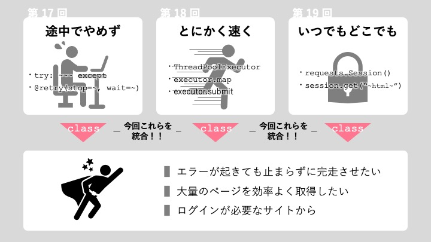

# 第20回：総合演習④ - ログイン必須サイトからデータ収集

## 今回のゴール

- 第17〜19回の知識（エラー処理・並列処理・認証）を統合できる
- スクレイパーをクラスとして設計できる
- ログインから複数ページ取得・データ保存までを一連の流れで実装できる

## 所要時間：90分

---

## 導入：これまでの知識をひとつにまとめる

第17回でエラー処理とリトライを、第18回で並列処理による高速化を、第19回でセッションを使ったログイン処理を学びました。

実際のスクレイピングプロジェクトでは、これらの技術を組み合わせて使います。例えば、次のような要件がよくあります。

```
要件の例:
- ログインが必要なサイトから
- 大量のページを効率よく取得したい
- エラーが起きても止まらずに完走させたい
- 収集したデータをCSVに保存したい
```

これらの要件は、第17〜19回で学んだ技術がそれぞれ対応しています。



これを実現するためには、バラバラに書いたコードをひとつの「システム」として整理する必要があります。

今回は、これまで学んだ知識をクラスを使ってまとめ、再利用しやすい形に整理する方法を学びます。

### クラスを使う理由

クラスとは、関連するデータと処理をひとまとめにするための仕組みです。

クラスを使わない場合：

```python
import requests

# 関数とグローバル変数がバラバラに存在する
session = requests.Session()

def login(session, url, username, password):
    ...

def get_quotes(session, url):
    ...

session = requests.Session()
login(session, LOGIN_URL, "user", "pass")
quotes = get_quotes(session, TOP_URL)
```

クラスを使った場合：

```python
# セッション・URLなどをクラスが持ち、メソッドで操作する
scraper = AuthScraper()
scraper.login("user", "pass")
quotes = scraper.get_quotes()
```

では、このクラスはどのように定義するのでしょうか。簡単な例を示します。

```python
class AuthScraper:
    def __init__(self):
        self.session = requests.Session()
    
    def login(self, username, password):
        # ログイン処理...
        pass
    
    def get_quotes(self):
        # 取得処理...
        pass
```

クラスを使うと、セッションなどの「状態」をクラス内で管理でき、呼び出し側がシンプルになります。大規模なスクレイピングでは、このような設計が保守性の向上に役立ちます。

---

## ハンズオン：クラスの基本構造を確認しよう

スクレイパークラスを作る前に、Pythonのクラスの基本を確認します。

```python
import requests

class SimpleScraper:
    def __init__(self, base_url):
        # インスタンスを作るときに自動で呼ばれる
        self.base_url = base_url
        self.session = None

    def setup(self):
        # セッションを初期化する
        self.session = requests.Session()
        self.session.headers.update({
            "User-Agent": "Mozilla/5.0"
        })

    def fetch(self, path):
        # ページを取得する
        url = self.base_url + path
        response = self.session.get(url, timeout=10)
        response.raise_for_status()
        return response.text

    def close(self):
        if self.session:
            self.session.close()


# 使い方
scraper = SimpleScraper("https://example.com")
scraper.setup()
html = scraper.fetch("/page1")
scraper.close()
```

ここで大切な概念「インスタンス」と「self」を説明します。

**インスタンスとは何か**

`scraper = SimpleScraper("https://example.com")` と書くと、**新しいインスタンスが作られます**。インスタンスとは、クラスという「設計図」から実際に作られた「実体」のことです。

例えるなら：
- クラス = ケーキのレシピ
- インスタンス = そのレシピから焼いた実際のケーキ
- `scraper` = 焼いたケーキの 1 個

この行を実行すると、自動で `__init__` メソッドが呼ばれます。このとき `self.session` は `None`（まだセッションなし）になります。実際のセッション作成は `setup()` で行います。

**`self` は「今扱っているインスタンス」を指す**

`self` は「このメソッドが属するインスタンス」を指します。`self.session` と書くことで「このインスタンスが持つ session」を意味します。

```python
def setup(self):
    self.session = requests.Session()  # このインスタンスの session を作る

def fetch(self, path):
    response = self.session.get(...)  # このインスタンスの session を使う
```

複数のインスタンスを作っても、それぞれが独立した `self.session` を持ちます。つまり、1つのクラスから複数のインスタンスを作り、それぞれが独立して動作することができます。

---

## 解説

### クラスの設計方針

スクレイパークラスを設計するときは、「何をする責任があるか」を考えます。

| 責任               | メソッド例        |
| ------------------ | ----------------- |
| セッションの初期化 | `__init__`        |
| ログイン処理       | `login()`         |
| ページの取得       | `_fetch_page()`   |
| データの抽出       | `_parse_quotes()` |
| 全体フロー         | `run()`           |

プレフィックスに `_` を付けたメソッド（例：`_fetch_page`）は「クラスの内部処理」を示す慣習です。外部から直接呼ぶのではなく、クラス内の他のメソッドから呼ばれることを想定しています。

### with 構文で安全に使えるようにする

`requests.Session()` と同様に、自分で作ったクラスも `with` 構文で使えるようにすることを推奨します。ブロックを抜けると自動でセッションが閉じられるため、リソースの解放漏れを防げます。

```python
class AuthScraper:
    def __enter__(self):
        return self  # with ブロックの変数に self を渡す

    def __exit__(self, exc_type, exc_val, exc_tb):
        self.session.close()  # with ブロックを抜けると自動で呼ばれる


# with 構文で使う
with AuthScraper() as scraper:
    scraper.login("user", "pass")
    quotes = scraper.get_quotes()
# ここで session.close() が自動で呼ばれる
```

### エラー処理・リトライ・ログを組み込む

第17〜19回の知識を組み込んだ構成の例です。

```python
import logging
import requests
from bs4 import BeautifulSoup
from tenacity import retry, stop_after_attempt, wait_exponential

logging.basicConfig(
    level=logging.INFO,
    format="%(asctime)s [%(levelname)s] %(message)s"
)

class AuthScraper:
    BASE_URL = "https://quotes.toscrape.com"
    LOGIN_URL = f"{BASE_URL}/login"

    def __init__(self):
        self.session = requests.Session()
        self.session.headers.update({
            "User-Agent": "Mozilla/5.0"
        })
        self._logged_in = False  # ログイン済みかどうかの状態管理

    def __enter__(self):
        return self

    def __exit__(self, exc_type, exc_val, exc_tb):
        self.session.close()

    def login(self, username, password):
        """ログイン処理"""
        # CSRF トークンを取得
        login_page = self.session.get(self.LOGIN_URL, timeout=10)
        soup = BeautifulSoup(login_page.text, "html.parser")
        csrf_token = soup.find("input", {"name": "csrf_token"})["value"]

        # ログイン POST
        self.session.post(self.LOGIN_URL, data={
            "csrf_token": csrf_token,
            "username": username,
            "password": password,
        }, timeout=10)

        # ログイン成功を確認
        top_page = self.session.get(self.BASE_URL, timeout=10)
        if "Logout" not in top_page.text:
            raise RuntimeError("ログインに失敗しました")

        self._logged_in = True
        logging.info("ログイン成功")

    @retry(stop=stop_after_attempt(3), wait=wait_exponential(min=1, max=8))
    def _fetch_page(self, url):
        """ページを取得する（リトライ付き）"""
        response = self.session.get(url, timeout=10)
        response.raise_for_status()
        return response.text

    def _parse_quotes(self, html):
        """名言データをパースする"""
        soup = BeautifulSoup(html, "html.parser")
        quotes = []
        for q in soup.select(".quote"):
            quotes.append({
                "text": q.select_one(".text").get_text(strip=True),
                "author": q.select_one(".author").get_text(strip=True),
                "tags": [t.get_text() for t in q.select(".tag")],
            })
        return quotes

    def get_quotes(self, max_pages=3):
        """複数ページから名言を取得する"""
        if not self._logged_in:
            raise RuntimeError("先に login() を呼んでください")

        all_quotes = []
        for page in range(1, max_pages + 1):
            url = f"{self.BASE_URL}/page/{page}/"
            try:
                html = self._fetch_page(url)
                quotes = self._parse_quotes(html)
                all_quotes.extend(quotes)
                logging.info(f"ページ {page}: {len(quotes)}件取得")
            except Exception as e:
                logging.error(f"ページ {page} の取得に失敗: {e}")
        return all_quotes
```

---

## 練習問題

### 問題1：基本的なスクレイパークラスを作る

以下の仕様を満たす `AuthScraper` クラスを作成してください。

```
仕様:
- __init__ でセッションを作成する
- login(username, password) でログインする
  - CSRF トークンを取得してからPOSTする
  - ログイン成功なら True、失敗なら False を返す
- get_quotes() でログイン後のトップページから名言を取得する
  - 名言のテキストと著者名を辞書のリストで返す
```

使い方のイメージ：

```python
scraper = AuthScraper()
success = scraper.login("testuser", "testpass")
if success:
    quotes = scraper.get_quotes()
    for q in quotes:
        print(f"「{q['text']}」 - {q['author']}")
scraper.session.close()
```

**考え方:**

```
1. class AuthScraper: でクラスを定義する
2. __init__ で self.session = requests.Session() を作る
3. login メソッドに第19回のログイン処理を移植する
4. get_quotes メソッドで session.get してパースする
5. ページに "Logout" があればログイン成功と判断する
```

---

### 問題2：with 構文に対応させる

問題1のクラスに `__enter__` と `__exit__` を追加して、`with` 構文で使えるようにしてください。

```python
# こう書けるようにする
with AuthScraper() as scraper:
    scraper.login("testuser", "testpass")
    quotes = scraper.get_quotes()
    print(f"{len(quotes)}件取得しました")
```

さらに、`with` ブロックを抜けたときにセッションが閉じられることを確認してください。

```python
with AuthScraper() as scraper:
    scraper.login("testuser", "testpass")

# with を抜けた後、セッションが閉じられたことを確認
# 例：get() を呼ぶとエラーになるか、または __exit__ のログ出力で確認する
print("セッションが正常に閉じられました")
```

**考え方:**

```
1. __enter__(self) で return self と書く
2. __exit__(self, exc_type, exc_val, exc_tb) で self.session.close() を呼ぶ
3. with ブロック内で処理を完了させる（ブロック内でセッションを使い切る）
```

---

### 問題3：複数ページ取得とエラー処理を追加する

以下の機能を追加してください。

```
追加機能:
- get_all_quotes(max_pages) で複数ページから名言を取得する
- 各ページのURLは /page/1/, /page/2/, ... の形式
- ページ取得に失敗してもスキップして次のページへ進む
- 取得できたページ数と名言の合計件数をログに出力する
- 取得した名言を pandas の DataFrame に変換して返す
```

期待する出力例：

```
[INFO] ページ 1: 10件取得
[INFO] ページ 2: 10件取得
[INFO] ページ 3: 10件取得
[INFO] 合計 3ページ / 30件取得しました
   text  author  tags
0   ...  Albert Einstein  [change, deep-thoughts, ...]
...
```

**考え方:**

```
1. for page in range(1, max_pages + 1) でループする
2. try/except で各ページのエラーをキャッチしてスキップする
3. all_quotes リストに extend で追加していく
4. 最後に pd.DataFrame(all_quotes) で変換する
```

---

### 問題4：並列処理でページ取得を高速化する

問題3の `get_all_quotes` メソッドを変更して、`ThreadPoolExecutor` を使ってページを並列取得するようにしてください。

```
変更内容:
- URLリストを先に作成する
- ThreadPoolExecutor(max_workers=3) で並列取得する
- 各ページの取得関数でエラーをキャッチして空リストを返す
- 直列処理との実行時間を比較する
```

期待する出力例：

```
直列: 6.4秒
並列: 2.3秒
```

**考え方:**

```
1. urls = [f"{BASE_URL}/page/{i}/" for i in range(1, max_pages + 1)] でURL一覧を作る
2. _fetch_and_parse(url) という1ページ分の処理をまとめたメソッドを作る
3. executor.map(_fetch_and_parse, urls) で並列実行する
4. time.time() で前後を計測して比較する
```

---

## 検索キーワード

| 知りたいこと            | 検索キーワード                       |
| ----------------------- | ------------------------------------ |
| Python クラスの基本     | `Python クラス 使い方 初心者`        |
| self とは               | `Python self 意味 クラス`            |
| **enter** **exit** とは | `Python with構文 __enter__ __exit__` |
| クラスの設計方法        | `Python クラス設計 責務 分け方`      |
| pandas DataFrame 作成   | `pandas DataFrame 作り方 リスト`     |

---

## 困ったときは

### 「セッションとは何か」

セッション（`requests.Session`）は、複数のリクエストにわたってログイン状態（Cookie）や設定を保持し続けるための仕組みです。ブラウザで一度ログインすると次のページでもログイン状態が続くのと同じ仕組みを、コードで再現しています。`requests.get()` を毎回単発で呼ぶとログイン状態が引き継がれませんが、セッションを使えば自動で引き継がれます。

### 「self が何かわからない」

`self` はそのクラスのインスタンス自身を指します。`self.session` と書くと「このインスタンスが持つ session」になります。`__init__` で `self.session = ...` と定義すれば、他のメソッドからも `self.session` でアクセスできます。

### 「login() を呼んでから get_quotes() を呼ばないといけないのが面倒」

`__init__` に `username` と `password` を渡して自動ログインする設計にすることもできます。使い方に合わせて設計を変えてみてください。

### 「with 構文の **exit** が呼ばれる条件がわからない」

`with` ブロックを抜けるときに必ず呼ばれます。正常終了でも、例外が発生しても呼ばれます。`exc_type` が `None` なら正常終了、値があれば例外が発生したことを意味します。

### 「並列処理をするとログインが切れる気がする」

`requests.Session` は一般にスレッドセーフであることが保証されていないため、同じ `self.session` を複数スレッドから同時に使い回す設計は避けましょう。

安全に並列化したい場合は、たとえば次のどちらかの方針を使います。

- スレッドごとに `Session` を作り、必要ならログイン後の Cookie をコピーして使う
- 並列部分では共有 `Session` を使わず、`requests.get(..., cookies=...)` のように Cookie を明示的に渡す

つまり、ログイン状態を維持したまま並列化したいときは、「1つの `Session` を共有する」のではなく、「認証情報や Cookie を安全に引き継ぐ」設計にするのがポイントです。

---

## 確認事項

- [ ] クラスを定義してインスタンスを作成できた
- [ ] `__init__` でセッションを初期化できた
- [ ] `login()` メソッドにログイン処理を実装できた
- [ ] `with` 構文に対応させることができた
- [ ] 複数ページを取得してまとめることができた
- [ ] 並列処理を組み込んで高速化できた

---

**次回は「定期実行と自動監視」です。スクリプトを自動で定期実行し、Webページの変更を自動検知する仕組みを学びます。**
