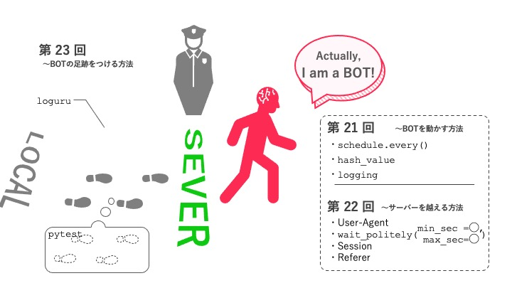

# 第21回：定期実行と自動化

## 今回のゴール

- `schedule` ライブラリを使ってスクリプトを定期実行できる
- Webページの変更をハッシュで検知できる
- 変更検知・通知・ログ記録を組み合わせた監視スクリプトを作れる

## 所要時間：90分

---

## 導入：スクレイピングを「自動化」する

この回から第23回まで、スクレイピングをより実用的に運用するための技術を学びます。



ここまでのレッスンでは、「プログラムを手動で実行してデータを収集する」方法を学んできました。しかし、実際の現場では「毎日決まった時刻にデータを収集したい」「ECサイトの価格が変わったらすぐに知りたい」といった要求がよくあります。

これは、アラームを使った朝の起床に似ています。毎朝手動でスマートフォンを操作して起きるのではなく、一度セットしておけば決まった時刻に自動で鳴るようにします。

スクレイピングスクリプトも同様に、一度設定しておけば自動で定期実行できます。

**定期実行が役に立つ場面の例：**

| やりたいこと                           | 実行スケジュール |
| -------------------------------------- | ---------------- |
| ECサイトの商品価格の変動を追う         | 1時間ごと        |
| ニュースサイトの新着記事を収集         | 30分ごと         |
| 社内システムのデータを毎朝バックアップ | 毎日9:00         |
| 特定ページの更新を監視して通知         | 15分ごと         |

今回は、`schedule` ライブラリを使った定期実行と、ハッシュ値を使ったページ変更検知の方法を学びます。

---

## ハンズオン：schedule の動きを確認しよう

以下のコードをファイルに保存して実行してください。5秒ごとにメッセージが表示されます（止めるには Ctrl+C）。

```python
import schedule
import time

def job():
    print(f"実行しました: {time.strftime('%H:%M:%S')}")

schedule.every(5).seconds.do(job)

print("スケジュールを開始します（Ctrl+C で終了）")
while True:
    schedule.run_pending()  # 実行すべきジョブがあれば実行する
    time.sleep(1)           # 1秒待機
```

`while` は「条件式が成り立つとき、下のインデントのプログラムを動かし続ける」という制御構文です。条件式の部分に `True`（常に真）を置くと、プログラムは「ずっと」動き続けます。この無限ループの中で、`schedule.run_pending()` が「実行すべき時刻になったジョブ」を確認して実行します。

---

## 解説

### schedule ライブラリの基本

`schedule` は、シンプルな定期実行を実現するライブラリです。

```python
import schedule

# 指定した間隔で実行する
schedule.every(10).minutes.do(job)   # 10分ごと
schedule.every(1).hours.do(job)      # 1時間ごと
schedule.every(2).days.do(job)       # 2日ごと

# 特定の時刻に実行する
schedule.every().day.at("09:00").do(job)       # 毎日9:00
schedule.every().monday.at("10:30").do(job)    # 毎週月曜10:30

# 複数のスケジュールを登録することもできる
schedule.every(30).minutes.do(collect_data)
schedule.every().day.at("08:00").do(send_report)
```

### schedule の動かし方

ジョブを登録しただけでは実行されません。以下のループを動かし続ける必要があります。

```python
while True:
    schedule.run_pending()  # 実行すべきジョブがあれば実行する
    time.sleep(1)
```

`schedule.run_pending()` は「現在時刻に実行すべきジョブがあれば実行し、なければ何もしない」関数です。これだけでは何度も何度も確認を繰り返すことになり、CPUに負荷がかかってしまいます。そこで `time.sleep(1)` を挟むことで、「一度ジョブを確認 → 1秒休む → もう一度ジョブを確認して必要に応じて実行」という流れになり、CPUの負荷を抑えられます。

### ハッシュを使った変更検知

「前回取得したページと今回取得したページが同じかどうか」を判定するには、ページの内容をハッシュ値（hash value、固定長の文字列）に変換して比較します。

```python
import hashlib

text = "Hello, World!"
hash_value = hashlib.md5(text.encode()).hexdigest()
print(hash_value)  # 65a8e27d8879283831b664bd8b7f0ad4

# 内容が1文字でも変わればハッシュ値が全く変わる
text2 = "Hello, World?"
hash_value2 = hashlib.md5(text2.encode()).hexdigest()
print(hash_value2)  # 異なる値が出る
```

**ハッシュ値の特性：**

- 同じ文字列からは必ず同じハッシュ値が得られる
- 内容が1文字でも違えば全く異なるハッシュ値になる
- ハッシュ値から元のテキストを復元することはできない
- どれだけ長いテキストでも一定（32文字）の長さになる

### 変更検知の基本パターン

```python
import hashlib
import requests

previous_hash = None  # 前回のハッシュ値を保存する変数

def check_for_changes(url):
    global previous_hash

    # ページを取得してハッシュを計算する
    response = requests.get(url, timeout=10)
    current_hash = hashlib.md5(response.text.encode()).hexdigest()

    if previous_hash is None:
        # 初回実行は比較対象がないので保存するだけ
        print("初回取得完了。次回から変更を検知します")
    elif current_hash != previous_hash:
        # ハッシュが変わっていれば変更あり
        print(f"変更を検知しました！")
    else:
        print("変更なし")

    # 今回のハッシュを保存して次回の比較に使う
    previous_hash = current_hash
```

### ハッシュ値をファイルに保存する

プログラムを再起動しても前回のハッシュ値を引き継ぐには、ファイルに保存します。

```python
import os

HASH_FILE = "last_hash.txt"

def load_previous_hash():
    """前回のハッシュをファイルから読み込む"""
    if os.path.exists(HASH_FILE):
        with open(HASH_FILE, "r") as f:
            return f.read().strip()
    return None  # ファイルがなければ初回実行

def save_hash(hash_value):
    """ハッシュをファイルに保存する"""
    with open(HASH_FILE, "w") as f:
        f.write(hash_value)
```

### logging と組み合わせる

定期実行スクリプトは長時間動き続けるため、何が起きたかをログファイルに残しておくと後で確認できます。

```python
import logging

logging.basicConfig(
    level=logging.INFO,
    format="%(asctime)s [%(levelname)s] %(message)s",
    handlers=[
        logging.FileHandler("monitor.log", encoding="utf-8"),  # ファイルにも出力
        logging.StreamHandler(),                                # コンソールにも出力
    ]
)
```

`handlers` を複数指定すると、コンソールとファイルの両方に同じログが出力されます。

---

## 練習問題

### 問題1：schedule の基本を使ってみる

`python/lesson21/01_schedule_basics.py` に回答を書いてください。

以下の条件でスクリプトを作成してください（確認できたら Ctrl+C で止めて構いません）。

```
条件:
- 3秒ごとに現在時刻を表示する
- 10秒ごとに "定期レポート" と表示する
- 2つのジョブを同時に動かす
```

期待する出力例：

```
[12:00:00] 現在時刻: 12:00:00
[12:00:03] 現在時刻: 12:00:03
[12:00:06] 現在時刻: 12:00:06
[12:00:09] 現在時刻: 12:00:09
[12:00:10] 定期レポート
[12:00:10] 現在時刻: 12:00:10
```

**考え方:**

```
1. schedule.every(3).seconds.do(job_a)
2. schedule.every(10).seconds.do(job_b)
3. while True: schedule.run_pending(); time.sleep(1)
4. 2つの関数を別々に定義して do() に渡す
```

---

### 問題2：ハッシュを使って変更を検知する

`python/lesson21/02_hash_change_detection.py` に回答を書いてください。

以下の条件で変更検知関数を作成してください。

```
条件:
- URL を受け取り、ページのコンテンツのハッシュを計算する
- 前回のハッシュと比較して変更の有無を判定する
- 変更があれば変更前・変更後のハッシュを表示する
- 結果を戻り値（True/False）で返す
- 前回のハッシュをファイル（last_hash.txt）に保存・読み込みする
```

動作確認用に、同じ URL で2回実行して「変更なし」と表示されることを確認してください。

**考え方:**

```
1. load_previous_hash() でファイルからハッシュを読む
2. requests.get でページ取得 → md5 でハッシュ計算
3. 前回と今回を比較
4. save_hash() でファイルに書き込む
5. 変更あり → True / 変更なし → False を返す
```

---

### 問題3：定期実行と変更検知を組み合わせる

`python/lesson21/03_schedule_monitoring.py` に回答を書いてください。

問題2の変更検知関数と `schedule` を組み合わせて、**30秒ごとにページの変更を確認するスクリプト** を作成してください。

```
条件:
- 監視対象: https://quotes.toscrape.com/
- 30秒ごとにチェックする
- 変更があれば「変更を検知しました！」を表示する
- 変更がなければ「変更なし」を表示する
- logging を使ってコンソールとファイル（monitor.log）に記録する
- スクリプトを起動したときに最初のチェックをすぐ実行する
```

期待するログ出力例：

```
2025-01-01 12:00:00 [INFO] 監視を開始します: https://quotes.toscrape.com/
2025-01-01 12:00:01 [INFO] 初回取得完了。次回から変更を検知します
2025-01-01 12:00:31 [INFO] 変更なし
2025-01-01 12:01:01 [INFO] 変更なし
```

**考え方:**

```
1. logging.basicConfig で FileHandler と StreamHandler を両方設定する
2. check_for_changes(url) 関数を定義する
3. schedule.every(30).seconds.do(check_for_changes, url=TARGET_URL)
4. while True の前に check_for_changes(TARGET_URL) を1回呼んで初回実行
5. while True でスケジュールを動かし続ける
```

---

### 問題4：変更箇所を差分で表示する

`python/lesson21/04_diff_display.py` に回答を書いてください。

ページの変更を検知したとき、何が変わったかをより詳しく表示してください。

```
条件:
- BeautifulSoup で名言のテキストだけを抽出してからハッシュを計算する
  （HTMLのコメントや広告が変わっても反応しないようにする）
- 変更検知時に、前回と今回の名言リストを比較する
- 追加された名言を「+ 追加:」、削除された名言を「- 削除:」と表示する
- difflib を使って差分を取る
```

期待する出力例（変更が起きたとき）：

```
変更を検知しました！
+ 追加: "New quote text here" - New Author
- 削除: "Old quote text here" - Old Author
```

**考え方:**

```
1. extract_quotes_text(html) 関数を作り、名言テキストのリストを返す
2. ページを取得して名言を抽出する
3. "\n".join(quotes_list) を md5 でハッシュ化する
4. 変更あり → 前回と今回の名言リストを difflib.unified_diff で比較する
5. 差分結果から「+」で始まる行を追加分、「-」で始まる行を削除分として表示する
```

---

## 検索キーワード

| 知りたいこと       | 検索キーワード                      |
| ------------------ | ----------------------------------- |
| schedule の使い方  | `Python schedule ライブラリ 使い方` |
| cron との違い      | `schedule cron 違い Python`         |
| md5 ハッシュの計算 | `Python hashlib md5 使い方`         |
| ファイルの読み書き | `Python ファイル 読み書き open`     |
| 差分を取る         | `Python difflib 差分 使い方`        |

---

## 困ったときは

### 「schedule が動かない」

`schedule.every(...).do(job)` でジョブを登録した後に `while True: schedule.run_pending(); time.sleep(1)` のループを実行する必要があります。ループを書き忘れているか、`time.sleep` が長すぎないか確認してください。

### 「Ctrl+C で止めても次に起動すると前回のハッシュが残っている」

それが正しい動作です。ファイルにハッシュを保存することで、プログラムを再起動しても前回の状態を引き継げます。毎回新鮮にチェックしたい場合は `last_hash.txt` ファイルを削除してから起動してください。

### 「ページが常に変化しているように見える」

HTMLにはアクセスのたびに変わる要素（タイムスタンプ・広告・アクセスカウンターなど）が含まれる場合があります。HTMLページ全体のハッシュではなく、問題4のように「注目したいコンテンツだけ」を抽出してからハッシュを取ると誤検知が減ります。

### 「while True ループを止める方法がわからない」

ターミナルで `Ctrl+C` を押すと `KeyboardInterrupt` が発生してループが止まります。これを `try/except` で処理すると、終了時の後片付け処理を追加できます。

```python
try:
    while True:
        schedule.run_pending()
        time.sleep(1)
except KeyboardInterrupt:
    logging.info("監視を終了しました")
```

---

## 確認事項

- [ ] `schedule.every(...).do(job)` でジョブを登録できた
- [ ] 複数のジョブを同時に動かせた
- [ ] `hashlib.md5` でハッシュ値を計算できた
- [ ] ハッシュ値をファイルに保存・読み込みできた
- [ ] 変更検知と `schedule` を組み合わせた定期監視スクリプトを作れた
- [ ] `logging` でログをファイルとコンソールの両方に出力できた

---

**次回は「アンチスクレイピング対策」です。Webサイト側のスクレイピング検知、User-Agent設定、そして倫理的・法的な観点を学びます。**
